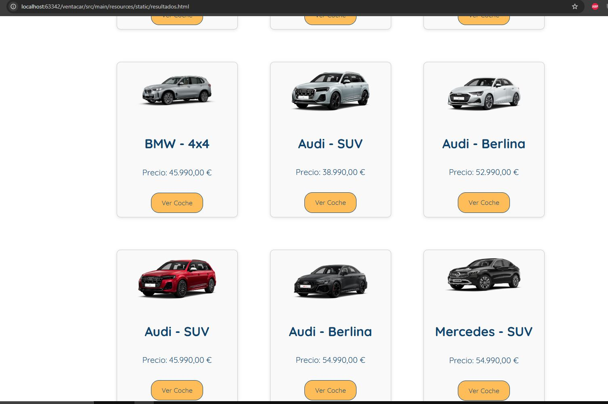
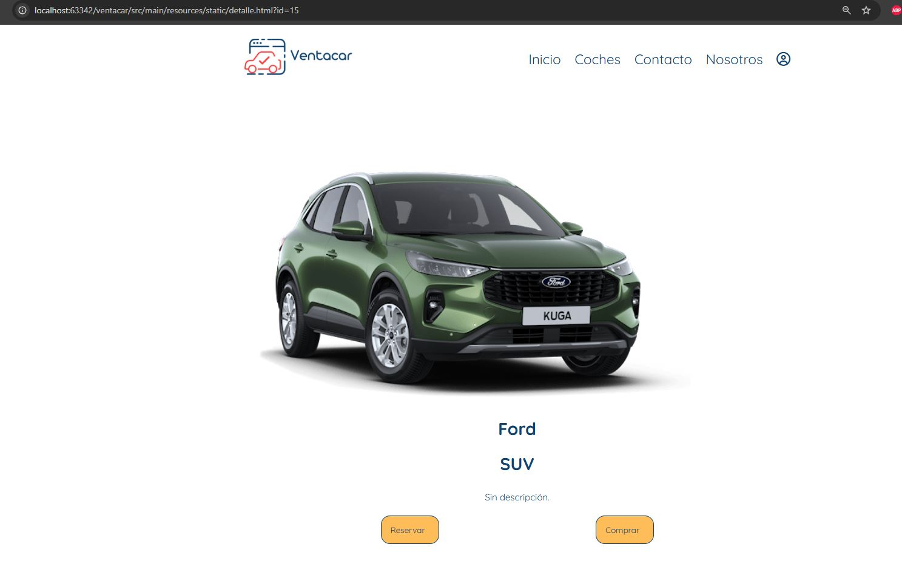

Ventacar - Proyecto WEB

Ventacar es una aplicación web para la compra y reserva de coches. Ofrece una plataforma sencilla y accesible donde los usuarios pueden reservar o comprar un coche de su elección

-Funcionalidades básicas-

Registro y autenticación de usuarios (login/logout)

Listado de vehículos con filtros de búsqueda.

Visualización de los detalles del coche (modelo, precio, características).

Reserva o compra del vehículo.

Generación de facturas (PDF) personalizadas para el usuario.

Envío de correos con factura integrada tanto para compras como para reservas de coches.

-Tecnologías-

Versión: JDK22, Jakarta EE 9

Frontend: HTML, CSS, JavaScript

Backend: Java, Spring Boot

Bases de datos: PostgreSQL

Servicios web: RESTful API

Servidor web: Tomcat 10.1

Editor: IntelliJ IDEA

Seguridad: Spring Security (roles User y Admin)

PDF y correo: Itext y Mailtrap con SMTP (para el envío de correos a los clientes)

Endpoints:
GET /api/vehiculos/buscar

GET /api/vehiculos/marca{marca}

GET /api/vehiculos/tipo{tipo}

GET /api/vehiculos/precio

